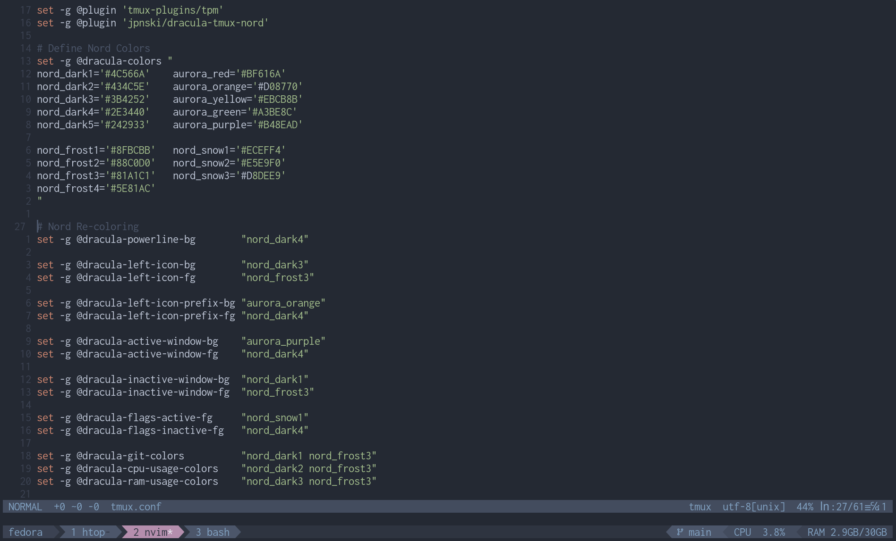

# Dracula Tmux Nord

Stripped down version of Dracula Tmux, recolored with Nord palette, with added visual notifications

### Appearance:



### Changes:
* Supports overriding more powerline visual elements in `tmux.conf`
  * Defines Nord theme palettes in config file, and applies the overrides
  * Falls back to default Dracula colors if no overrides applied
* Adds window bell visual notification configuration option for inactive windows
  * To work with Claude hooks firing during elicitation/permission prompts, for example
* Removed many Dracula plugins and their configuration code
* Made for cohesion with `nord_minimal` Vim Airline and `nordic_nvim` Neovim theme

---

### Available Powerline Plugins

| Plugin | Description |
|--------|-------------|
| `git` | Git status |
| `cpu-usage` | CPU usage |
| `ram-usage` | RAM usage |
| `gpu-usage` | GPU usage |
| `gpu-ram-usage` | GPU RAM |
| `krbtgt` | Kerberos ticket |
| `kubernetes-context` | Kubernetes context |
| `terraform` | Terraform workspace |
| `continuum` | Continuum backup |
| `attached-clients` | Connected clients |
| `ssh-session` | SSH session |
| `uptime` | System uptime |
| `synchronize-panes` | Sync panes |
| `custom:<script>` | Run custom script |

### Added Color Overrides

| Option | Default | Description |
|--------|---------|-------------|
| `@dracula-left-icon-bg` | green | Left icon background |
| `@dracula-left-icon-fg` | dark_gray | Left icon foreground |
| `@dracula-left-icon-prefix-bg` | yellow | Prefix indicator background |
| `@dracula-left-icon-prefix-fg` | dark_gray | Prefix indicator foreground |
| `@dracula-active-window-bg` | dark_purple | Active window background |
| `@dracula-active-window-fg` | white | Active window foreground |
| `@dracula-inactive-window-bg` | (inherits) | Inactive window background |
| `@dracula-inactive-window-fg` | white | Inactive window foreground |
| `@dracula-flags-active-fg` | light_purple | Window flags (active) foreground |
| `@dracula-flags-inactive-fg` | dark_purple | Window flags (inactive) foreground |
| `@dracula-powerline-bg` | gray | Powerline background |

### Window Bell Visual Notification

Highlights inactive window tabs when a bell fires in that window (e.g. a
background process completing). When enabled, the tab recolors with a configurable
bg color. Text blinking can be toggled independently.
* Window title fg blinking depends on terminal emulator's OSC5 implementation (works in Gnome/Kitty terminals, does not work in Alacritty/Foot terminals)

| Option | Default | Description |
|--------|---------|-------------|
| `@dracula-window-bell` | false | Enable bell highlighting on inactive windows |
| `@dracula-window-bell-blink` | true | Blink the window title text on bell |
| `@dracula-window-bell-fg` | dark_gray | Bell highlight foreground |
| `@dracula-window-bell-bg` | yellow | Bell highlight background |


#### Claude Window Bell Hook Config
```bash
...
  "hooks": {
    "Notification": [
      {
        "matcher": "permission_prompt|elicitation_dialog",
        "hooks": [
          {
            "type": "command",
            "command": "tmux split-window -t $TMUX_PANE -d -l 1 \"printf '\\a'; sleep 0.5\""
          }
        ]
      }
    ]
  }
...
```

#### Opencode Window Bell Plugin Config
Using a simple plugin in `~/.config/opencode/plugins/notify-bell.js` to emulate the Claude Code `hook > match > command` behavior that rings a term bell in response to user-prompt-required events.

This plugin can be toggled on/off in the TUI Settings/Plugins menu, requires defining it in `opencode.json` and `tui.json`:
* `plugin:["file:///home/{user}/.config/opencode/plugins/notify-bell.json"]`

```javascript
const ENABLED_EVENTS = new Set([
  'permission.asked',
  'question.asked',
  'session.error',
])

const DEBOUNCE_MS = 1200

export default {
  id: "notify-bell",
  tui: async (api) => {
    const bell = '\x07'
    const last = new Map()

    const ring = (key, now = Date.now()) => {
      const prev = last.get(key) || 0
      if (now - prev < DEBOUNCE_MS) return
      last.set(key, now)
      process.stdout.write(bell)
    }

    for (const eventType of ENABLED_EVENTS) {
      api.event.on(eventType, (event) => {
        const key = event.properties?.sessionID
          ? `${event.type}:${event.properties.sessionID}`
          : event.type
        ring(key)
      })
    }
  },
}

```


### Example Theme + Bell `tmux.conf`
```bash
# ~/.config/tmux/tmux.conf

# Define Nord Colors
set -g @dracula-colors "
nord_dark1='#4C566A'    aurora_red='#BF616A'
nord_dark2='#434C5E'    aurora_orange='#D08770'
nord_dark3='#3B4252'    aurora_yellow='#EBCB8B'
nord_dark4='#2E3440'    aurora_green='#A3BE8C'
nord_dark5='#242933'    aurora_purple='#B48EAD'

nord_frost1='#8FBCBB'   nord_snow1='#ECEFF4'
nord_frost2='#88C0D0'   nord_snow2='#E5E9F0'
nord_frost3='#81A1C1'   nord_snow3='#D8DEE9'
nord_frost4='#5E81AC'
"

# Nord Re-coloring
set -g @dracula-powerline-bg        "nord_dark4"

set -g @dracula-left-icon-bg        "nord_dark3"
set -g @dracula-left-icon-fg        "nord_frost3"

set -g @dracula-left-icon-prefix-bg "aurora_orange"
set -g @dracula-left-icon-prefix-fg "nord_dark4"

set -g @dracula-active-window-bg    "aurora_purple"
set -g @dracula-active-window-fg    "nord_dark4"

set -g @dracula-inactive-window-bg  "nord_dark1"
set -g @dracula-inactive-window-fg  "nord_frost3"

set -g @dracula-flags-active-fg     "nord_snow1"
set -g @dracula-flags-inactive-fg   "nord_dark4"

set -g @dracula-git-colors          "nord_dark1 nord_frost3"
set -g @dracula-cpu-usage-colors    "nord_dark2 nord_frost3"
set -g @dracula-ram-usage-colors    "nord_dark3 nord_frost3"

# Enable bell highlighting with blinking
set -g @dracula-window-bell       true
set -g @dracula-window-bell-blink true
set -g @dracula-window-bell-fg    "nord_dark4"
set -g @dracula-window-bell-bg    "aurora_yellow"
```

## License

[MIT License](./LICENSE)
